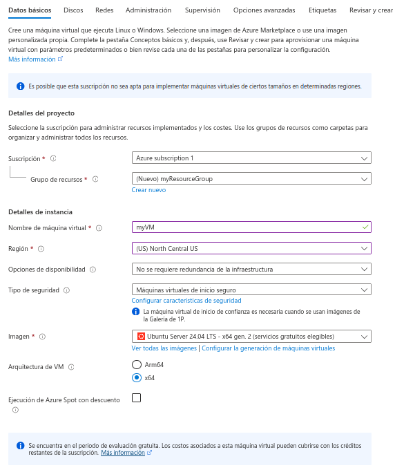
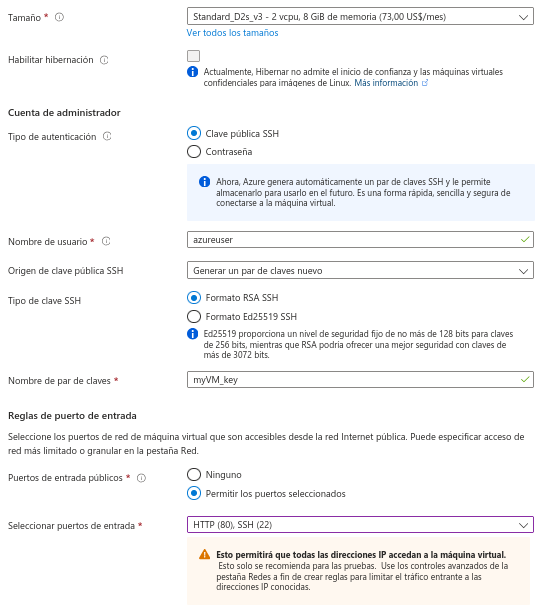
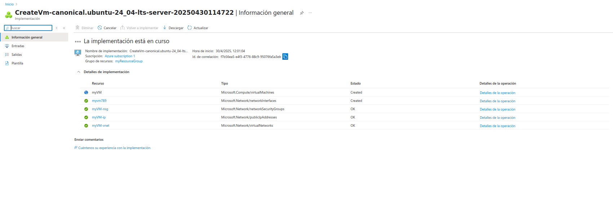
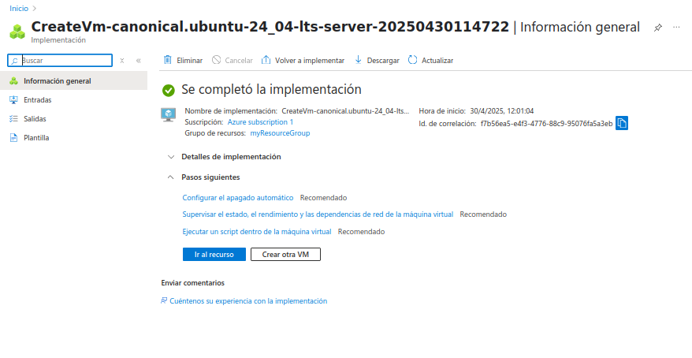
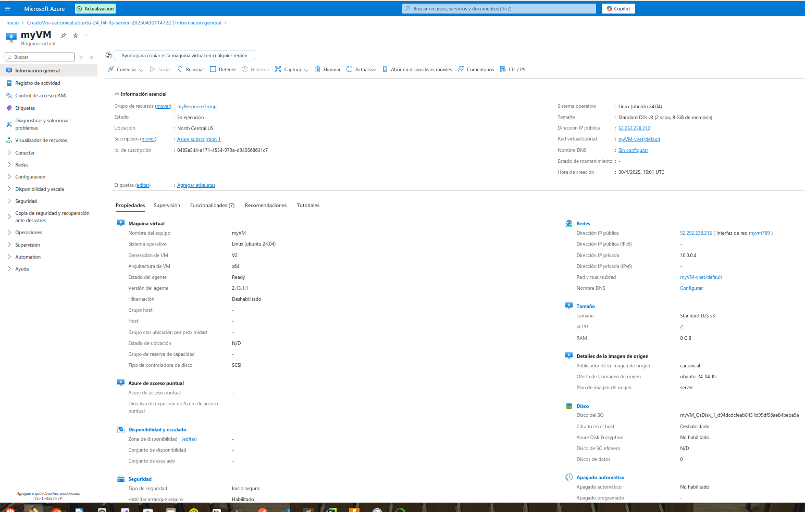
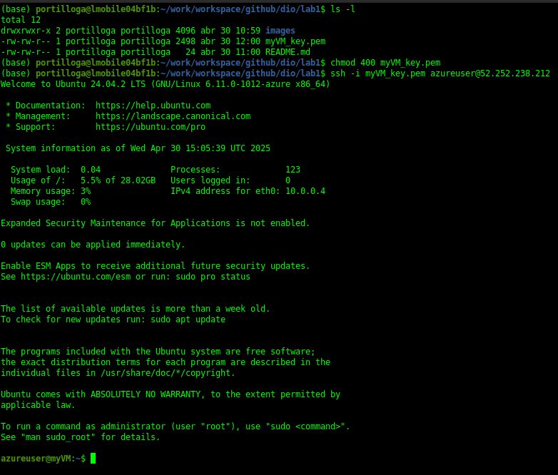
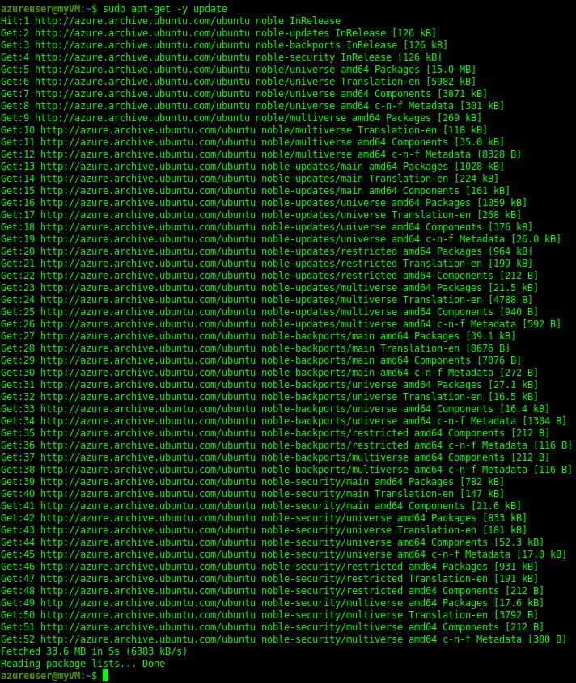
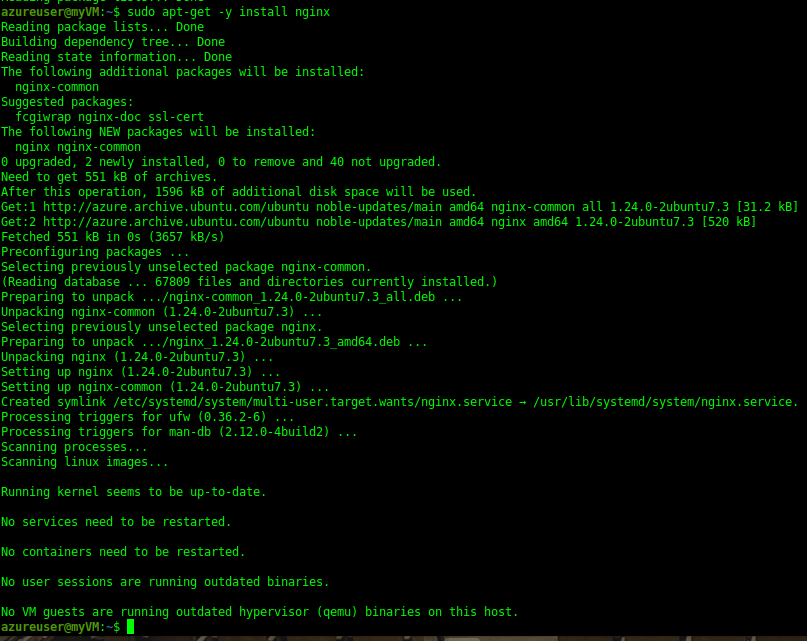

# Lab1: Beneficios da nuvem - Laboratório

1. Entre no portal do Azure.
   
   `https://portal.azure.com` 

2. Criar máquina virtual

3. Selecione "Criar um recurso" na tela incial
   

4. Selecione Máquina virtual. (criar)
   

5. Na página Máquinas virtuais, clique em Criar, e em seguida, selecione Máquina virtual. A página Criar uma máquina virtual é aberta.

6. Ecolha Criar grupo de recursos. Digite **myResourceGroup** para o nome.

7. Em Detalhes da instância:
   
   1. insira **myVM** para o Nome da máquina virtual 
   
   2. Escolha ***Ubuntu Server 22.04 LTS – Gen2*** para Imagem.

8. Em region selecione **North Central US**.
   Segue a imagem resumo com os passos 7,8,9,10
    

9. Em Conta do administrador, selecione Chave pública SSH.

10. Em Nome de Usuário, insira **azureuser**.

11. Em Origem de chave pública SSH, mantenha o padrão de Gerar novo par de chaves e insira myKey para Nome do par de chaves.

12. Em Regras de porta de entrada:
    Portas de entrada públicas: escolha Permitir portas selecionadas e, em seguida, selecione SSH (22) e HTTP (80) na lista suspensa.
    Segue a imagem resumo com os passos 11,12,13,14
     

13. Selecione o botão ***Examinar + criar*** na parte inferior da página

14. Na página Criar uma máquina virtual, você pode ver os detalhes sobre a VM que você está prestes a criar. Quando estiver pronto, selecione Criar.
     

15. Quando a janela Gerar novo par de chaves for aberta, selecione Baixar chave privada e criar recurso. O arquivo de chave será baixado como **myKey.pem.** 

16. Depois que a implantação for concluída, selecione Ir para o recurso.
    

17. Na página da nova VM, selecione o endereço IP público e copie-o para a área de transferência. neste caso o endereço IP é 52.252.238.212
    

18. Conectar-se à máquina virtual:
    
    Mude as permições do arquivo myVM_key.pem
    
    `chmod 400 myVM_key.pem`
    
    Conecte-se via ssh
    
    `ssh -i myVM_key.pem azureuser@52.252.238.212`
    
     

19. Instalar servidor Web
    
    `sudo apt-get -y update`
    
    
    
    `sudo apt-get -y install nginx`
    
    

20. Quando terminar, digite exit para sair da sessão SSH.

21. Use um navegador da Web de sua escolha para exibir a página inicial padrão do NGINX. Digite o endereço IP **52.252.238.212** como o endereço Web.
    
