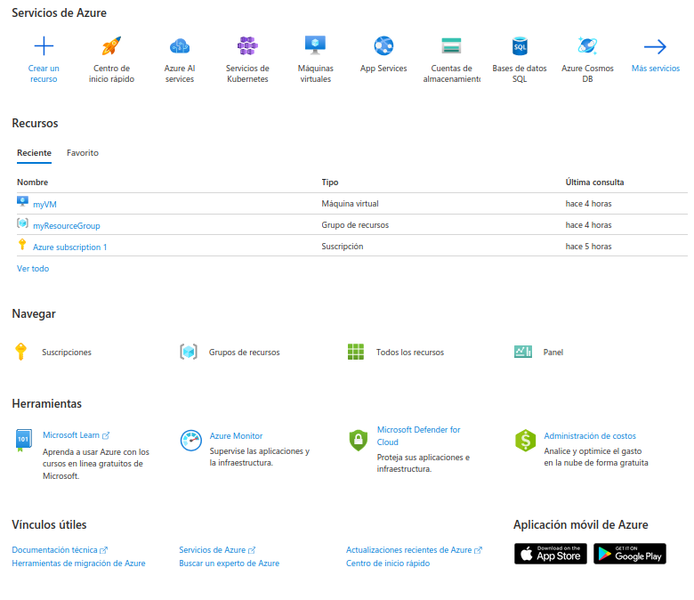
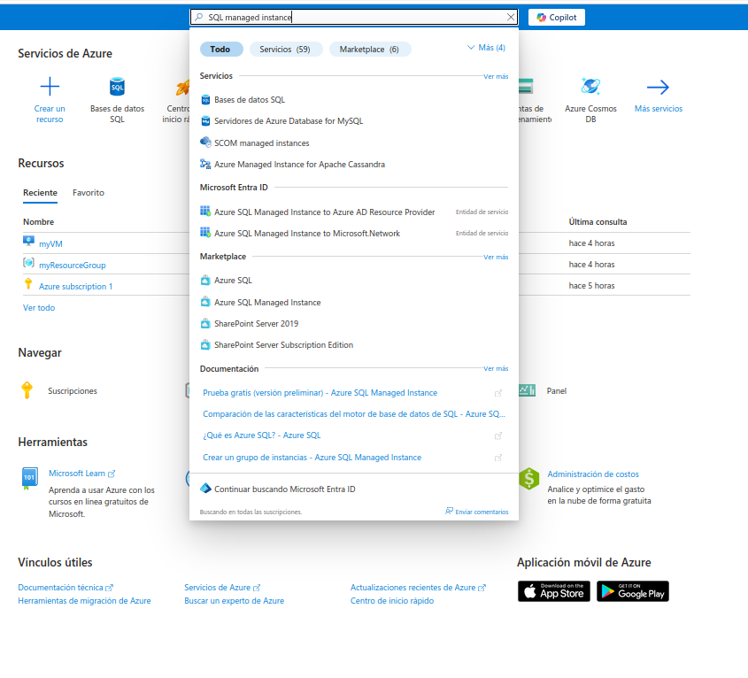
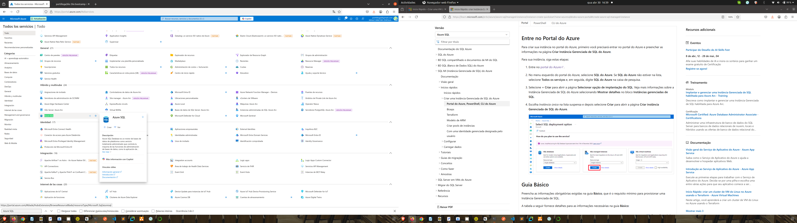
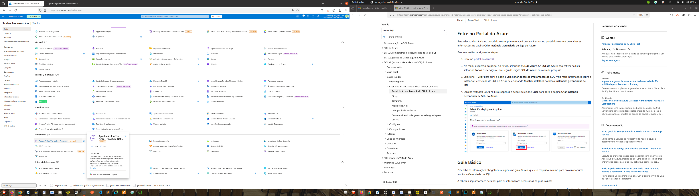
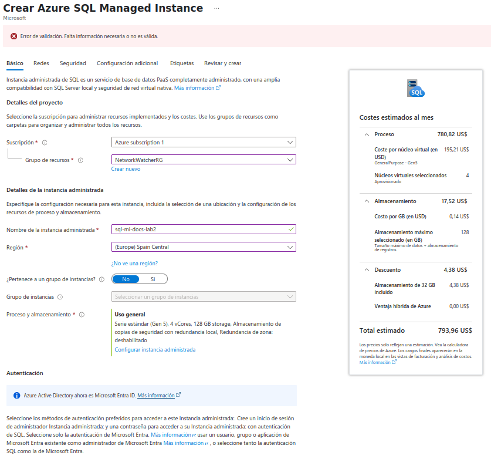
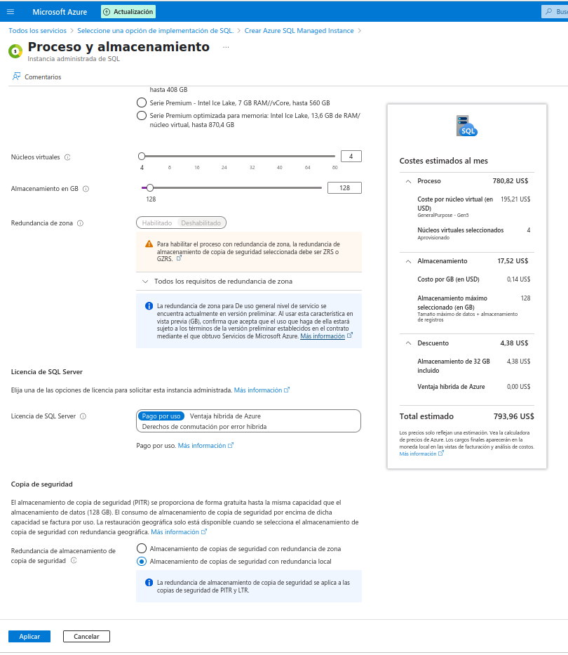
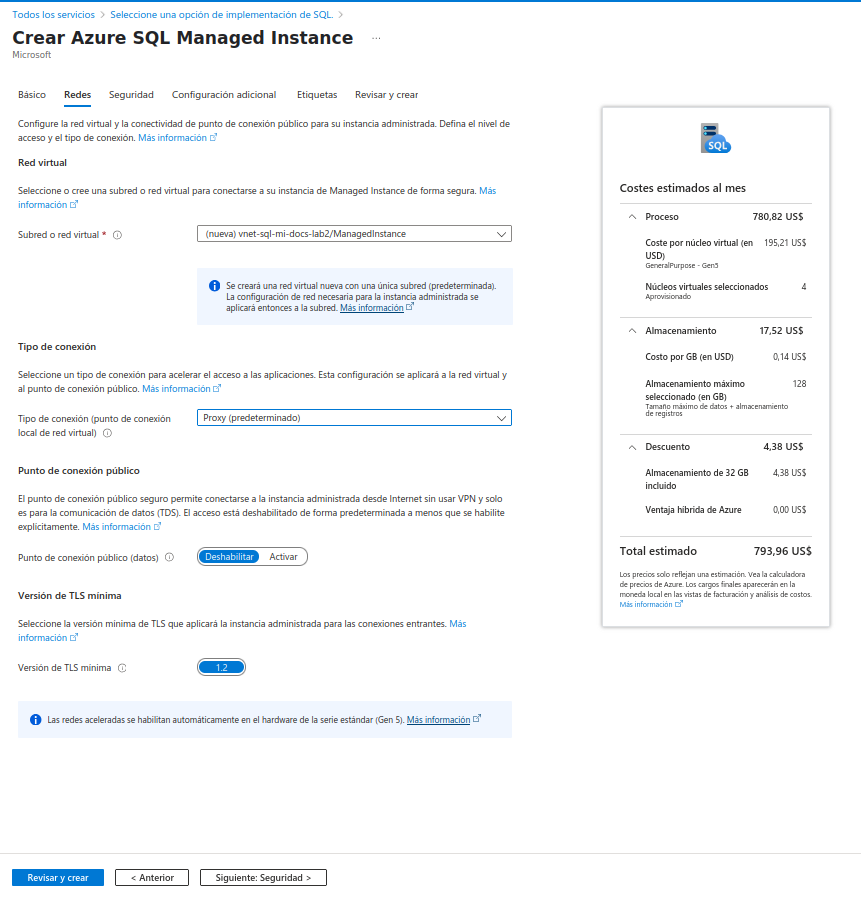
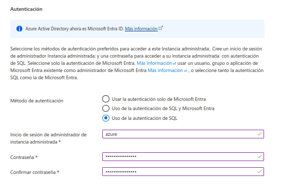
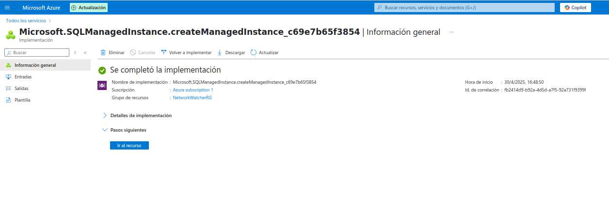

# Lab2: Tipos de Serviço de Nuvem - Laboratório

1. Entre no portal do Azure.  
   
   `https://portal.azure.com` 
   

2. Digite "SQL managed instance" em pesquisa, e selecione "Bancode dados SQL",tudo isso na tela principal
   

3. Selecione "Criar banco de dados" na tela incial
   

4. Selecione "Managed SQL Instance" na tela seguinte
   

5. Na página "Create Azure SQL Managed Instance", preencha o nome da instância e seleção a região
   

6. Na página "Create Azure SQL Managed Instance", seleção a opção "Configure Managed Instance":
   

7. Na página "Create Azure SQL Managed Instance", seleção a guia rede e preencha:
   

8. Na página "Create Azure SQL Managed Instance", seleção a guia seguraça e preencha:
   

   a palavra chave é: 2qKKKPqV6Q3BQc5X

9. Selecione o botão ***criar*** na parte inferior da página
   
10. Em breve a instáncia vai ser criada
   